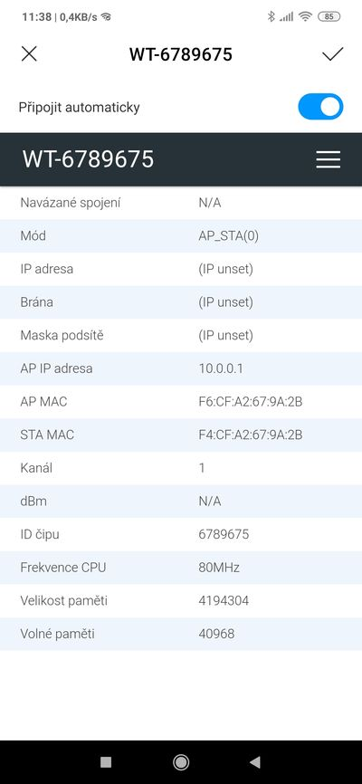
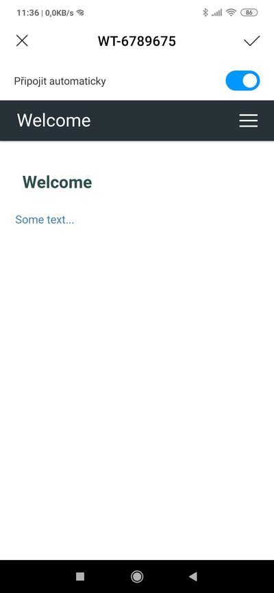

# Repository to demonstrate issue with AutoConnect startup page.

## Tools used

Visual Studio Code
PlatformIO

## Steps

1. update `platformio.ini` with your device, compile project, upload
1. connect to new WiFi, wait for captive portal

    this page is loaded:

    

1. update `platformio.ini`, change AutoConnect library branch to this:

    ```
        https://github.com/dmaixner/AutoConnect#menuorder
        ; https://github.com/Hieromon/AutoConnect
    ```

1. compile, upload, connect to new WiFi, wait for captive portal

    this page is loaded:

    
